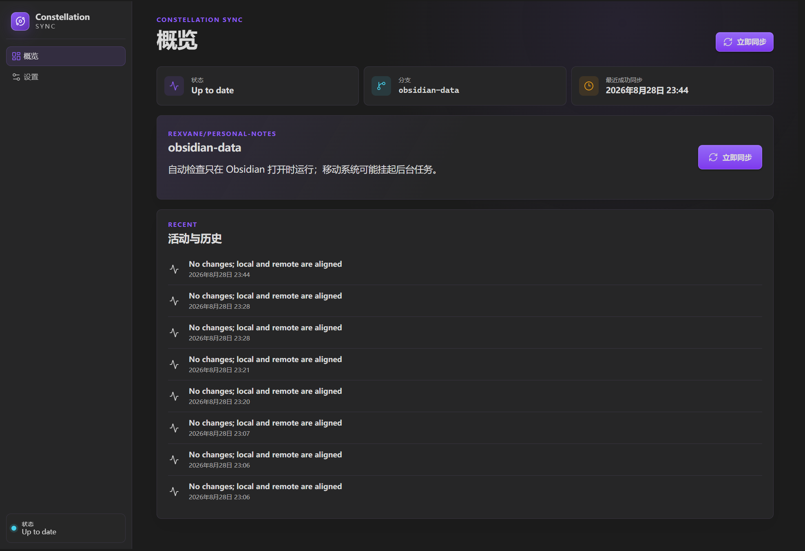
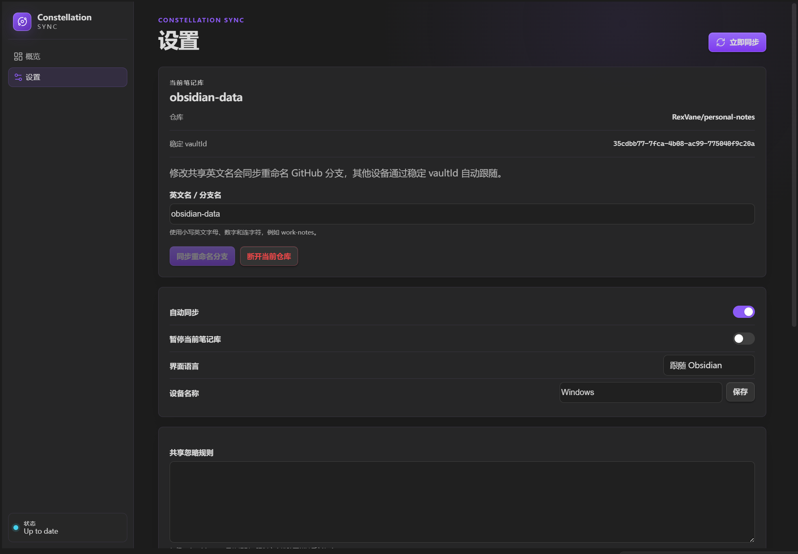

[English](README.md) | **简体中文**

# Constellation Sync

Constellation Sync 是一个 Obsidian 社区插件，通过 GitHub 私有仓库在多台设备之间同步笔记。一个私有仓库可以承载多个笔记库，每个笔记库使用一个独立的 GitHub 分支。

## 截图

## 安装

1. **从 Obsidian 内** — 第三方插件 → 浏览 → 搜索 "Constellation Sync"（插件上架后可用）。
2. **通过 BRAT** — 安装 BRAT 后执行 "BRAT: Add a beta plugin"，输入 `RexVane/obsidian-constellation-sync` 并启用插件。
3. **手动安装** — 从 [最新 Release](https://github.com/RexVane/obsidian-constellation-sync/releases/latest) 下载 `main.js`、`manifest.json` 和 `styles.css`，放入 `<笔记库>/.obsidian/plugins/constellation-sync/` 并启用。

## 快速上手

1. 点击 orbit 图标打开仪表盘，用 GitHub 访问令牌连接——登录页写明了选哪种令牌、需要哪些权限。需要一个专用的**私有**仓库。
2. 选择仓库后绑定笔记库：直接使用仓库默认分支、新建分支，或加入已有分支。
3. 完成。同步自动进行；冲突内容会保留为冲突副本，绝不静默覆盖。

## 数据模型

- 一个专用的 GitHub 私有仓库可以包含多个笔记库。
- 每个笔记库位于一个非默认分支的根目录中。
- 分支名使用笔记库的共享英文名，例如 `work-notes`。
- `.constellation-sync/vault.json` 保存稳定的 `vaultId`，因此分支改名后其他设备仍能跟随。
- 默认分支只作为仓库入口，不用于存放笔记库数据。
- 可见空目录会使用内部隐藏文件 `.constellation-sync-empty-folder` 表示，使 GitHub 和其他设备能够完整还原笔记库目录结构；目录中出现真实文件后，标记会自动移除。
- 发现远端笔记库时会按稳定 `vaultId` 去重、显示真实 GitHub 分支名，并在其他设备加入时再次校验规范分支，避免误选旧的重复分支。

## 同步规则

插件以最近一次成功同步的共同版本为基线，比较本地和远端分别发生的变化。只有一侧修改时，修改会同步到另一侧；两侧修改不同位置时会尝试合并；修改同一位置、删除与修改冲突、二进制文件或无法安全合并的内容会保留冲突副本并在冲突列表中等待处理。插件不会使用文件修改时间静默覆盖另一侧，也不会把冲突内容直接丢弃。

本地文件只在远端提交成功之后才被改写，因此推送失败时笔记库保持原样。无法在所有平台安全保存的路径会被跳过并列出，而不会拖住其余文件的同步。

## 安全与隐私

插件使用你创建并粘贴进来的 GitHub 个人访问令牌（PAT）连接 GitHub。令牌只保存在 Obsidian SecretStorage 中，绝不写入笔记文件、`data.json` 或 Git 历史。细粒度令牌（Fine-grained tokens）可以只授权同步仓库的 Contents 读写权限；插件预填的经典令牌带有更宽的 `repo` 权限，建议设置为永不过期。你随时可以在 GitHub 上吊销令牌。私有仓库只控制访问权限，并不等于端到端加密：GitHub 以及拥有仓库权限的人可以读取同步内容。分步操作说明见 [`docs/github-token-setup.zh-CN.md`](docs/github-token-setup.zh-CN.md)。

本公开仓库不包含用户令牌、Client Secret、本地笔记或 `.env.local`。编译后的 `main.js` 不提交到源码分支，只作为带版本号的 GitHub Release 资产发布。

## 从源码构建

1. 下载或克隆本仓库。
2. 安装 Node.js 20 或更高版本，执行 `npm ci`。
3. 执行 `npm run build`。
4. 将 `main.js`、`manifest.json` 和 `styles.css` 复制到 `<笔记库>/.obsidian/plugins/constellation-sync/`，然后在 Obsidian 中启用插件。

本项目采用源码优先的公开发布方式；社区插件 Release 会提供已经配置好的 `main.js`，供 Obsidian 一键安装。

## 开发与验证

1. 执行 `npm install`。
2. 执行 `npm run dev` 进入监听模式构建，或 `npm run check` 运行完整验证套件。

不需要任何构建变量：插件中不含 OAuth Client ID、Client Secret 或 GitHub App 配置。令牌配置步骤请参阅 [`docs/github-token-setup.zh-CN.md`](docs/github-token-setup.zh-CN.md)。

## 状态

当前发布版本为 `0.2.1`：连接 GitHub 只需创建一个访问令牌并粘贴进来（登录页内置两种令牌的逐步说明）；首次绑定可以直接使用仓库默认分支，也可以新建分支或加入已有分支。仪表盘精简为"概览"和"设置"两页，冲突直接显示在概览中，同步策略只保留忽略规则和显式列出的社区插件数据。使用旧版本连接的设备，在 App 会话过期后用令牌重新登录一次即可。

## 开源协议

本项目采用 MIT License，详见 [`LICENSE`](LICENSE)。
